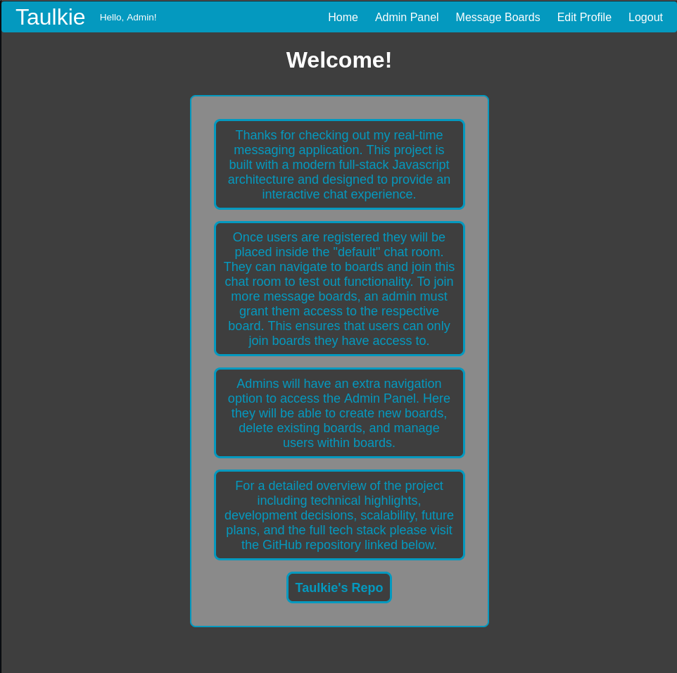
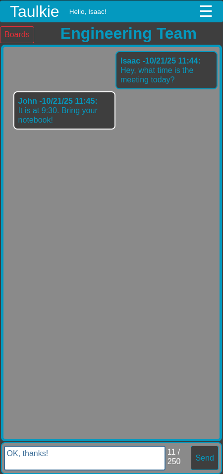
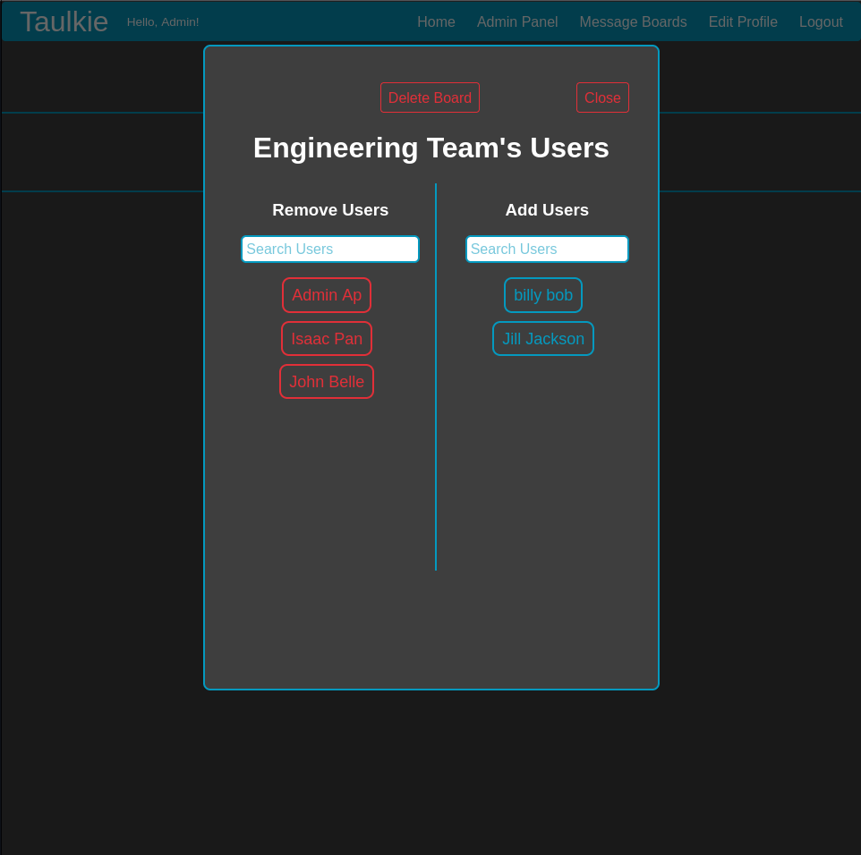

# Taulkie: Real-Time 🚀 Messaging App with Admin Panel 
## **React, Node.js, Express, Socket.IO – Full-stack messaging platform with role-based access**
### 🎥 Demo Videos (PLANNED)
- [Quick Overview](#)
- [In-depth Overview](#)
- [Authentication/Axios Walkthrough](#)
### 🐳 Download as a Docker container and try yourself! (PLANNED)
- [Docker Page](#)

### Home Screen

### Chat Interface

### Admin Panel

### ✨ Features
- **Real-time Messaging:** Instant updates on new messages
- **Role-based access:** Differentiates between user and admin roles with permissions
- **Secure Authentication:** JWT tokens are used for securely storing critical data and verifying users
- **Protected routes:** Custom middleware to restrict access based on role and ensuring no unauthorized access
- **Axios Interceptors:** Ensure smooth API calls with automatic retries and error handling
- **Persistent Chat History:** Messages are saved in MongoDB, ensuring no loss of data
- **Responsive UI:** Built with React and custom styled-components
- **Modular Architecture:** Separation of Authentication & Business Logic, following a modular architecture for easier scaling, maintenance, and reusability

### 🛠️ Tech Stack
- **Frontend:** React, Axios, Socket.IO-client
- **Backend:** Node.js, Express, Socket.IO
- **Database:** MongoDB
- **Authentication:** JWT

### 📝 Future Enhancements
- Push Notifications: Real-time Notifications for new messages and user activity
- User Profile Pictures: Add the ability for users to add profile pictures
- Message Search: Allow for searching through message boards for past messages
- Admin Dashboard: Add analytics to the dashboard
